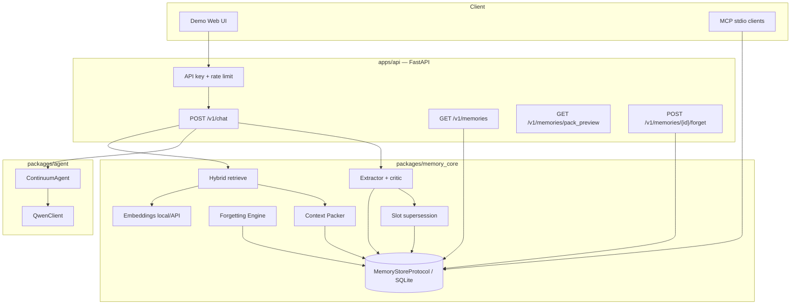

# Continuum Architecture

Continuum delivers a MemoryAgent vertical slice: **Session A writes memories → hybrid retrieve → pack under budget → agent cites memory IDs**.

## Components

## Data flow (chat)

1. **Retrieve** hybrid candidates (sparse keyword/entity + dense embedding cosine); never pack by scoring the full workspace alone.
2. **Pack** candidates under `memory_token_budget` (`type_quota`, `greedy`, `knapsack_dp`, `mmr`).
3. **Agent** replies citing packed memory IDs (Qwen or offline mode); memory text is sanitized against injection patterns.
4. **Ingest** the turn (heuristic or LLM extract + critic) with slot-aware supersession.

## Auth & tenancy

- `CONTINUUM_API_KEYS` enables API key auth (`X-API-Key` or `Authorization: Bearer`).
- Empty keys or `CONTINUUM_AUTH_DISABLED=1` → local demo open.
- Forget/get are workspace-scoped (IDOR-safe): wrong `workspace_id` → 404.
- Rate limit: `CONTINUUM_RATE_LIMIT_RPM` (default 60). Request IDs via `X-Request-Id`.

## Storage

- **Shipped:** SQLite via `MemoryStore` (`CONTINUUM_DB_PATH`).
- **Interface:** `MemoryStoreProtocol` + `create_store()` in `store_base.py`.
- **Later:** Postgres when `DATABASE_URL` starts with `postgres` (optional extra; not fully shipped).

## MCP

Real stdio server: `python -m continuum_mcp` (JSON-RPC loop; uses `mcp` SDK if installed). Tools: search, remember, forget, list, explain, pack_preview.

## Eval

Offline suite in `evals/` with ≥15 fixtures and baselines (`no_memory`, `full_history_dump`, `naive_topk_keyword`, `continuum_pack`).

## Still later

Alibaba Cloud deployment (Tablestore, Redis, FC), full Postgres ops, stronger NLI supersession, production multi-tenant SaaS hardening.
