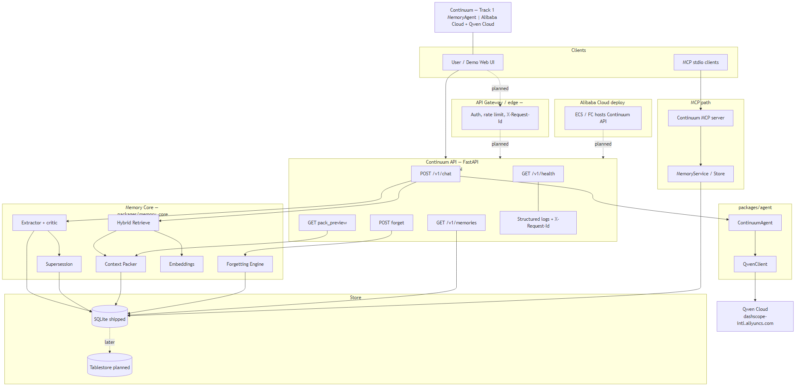
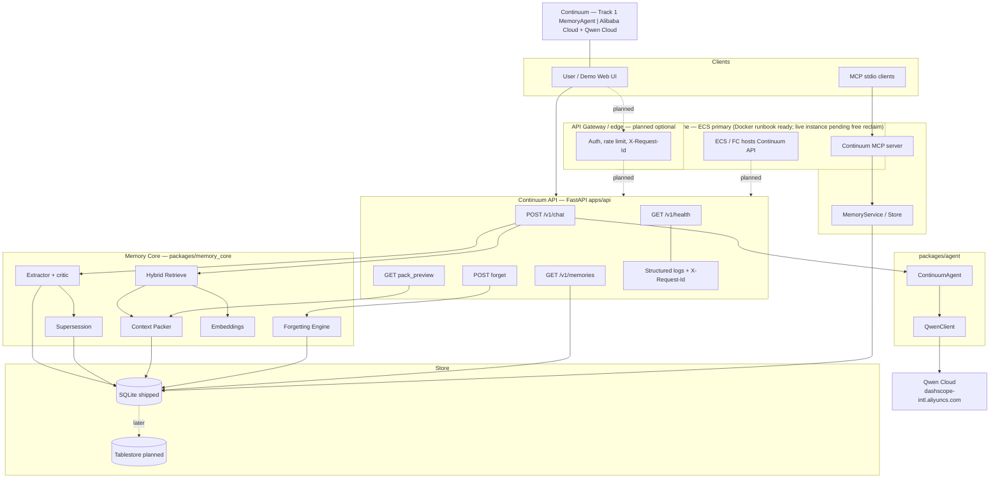

# Continuum Architecture

## Architecture diagram (Devpost)

Upload **`architecture.png`** on Devpost as the architecture image for Continuum.

---

Continuum is a **Track 1 MemoryAgent** vertical slice on **Alibaba Cloud** + **Qwen Cloud**: **Session A writes memories → hybrid retrieve → pack under budget → agent cites memory IDs**.

## Components

**Shipped path:** Demo Web UI → Continuum API (auth/rate limit/X-Request-Id in-app) → Memory Core (retrieve/pack/extract) → ContinuumAgent → QwenClient → Qwen Cloud (DashScope compatible-mode: `dashscope-intl.aliyuncs.com`); store is SQLite. MCP stdio clients talk to the Continuum MCP server → MemoryService/Store.

**Planned / later (dashed):** optional API Gateway/edge, Tablestore. **ECS hosting:** Docker/runbook ready in `infra/`; **live public URL pending free-instance reclaim** (overnight 2026-07-20: prior Singapore free ECS gone — see [PROOF_OF_ALIBABA_DEPLOYMENT.md](PROOF_OF_ALIBABA_DEPLOYMENT.md) and [OVERNIGHT_STATUS.md](OVERNIGHT_STATUS.md)). Do not treat dashed Host→API as currently live.

## Data flow (chat)

1. **Retrieve** hybrid candidates (sparse keyword/entity + dense embedding cosine); never pack by scoring the full workspace alone.
2. **Pack** candidates under `memory_token_budget` (`type_quota`, `greedy`, `knapsack_dp`, `mmr`).
3. **Agent** replies citing packed memory IDs (Qwen or offline mode); memory text is sanitized against injection patterns.
4. **Ingest** the turn (heuristic or LLM extract + critic) with slot-aware supersession.

## Auth & tenancy

- `CONTINUUM_API_KEYS` enables API key auth (`X-API-Key` or `Authorization: Bearer`).
- Empty keys or `CONTINUUM_AUTH_DISABLED=1` → local demo open.
- Forget/get are workspace-scoped (IDOR-safe): wrong `workspace_id` → 404.
- Rate limit: `CONTINUUM_RATE_LIMIT_RPM` (default 60). Request IDs via `X-Request-Id`.

## Storage

- **Shipped:** SQLite via `MemoryStore` (`CONTINUUM_DB_PATH`).
- **Interface:** `MemoryStoreProtocol` + `create_store()` in `store_base.py`.
- **Later:** Postgres when `DATABASE_URL` starts with `postgres` (optional extra; not fully shipped). Tablestore on Alibaba Cloud is planned for cloud scale.

## MCP

Real stdio server: `python -m continuum_mcp` (JSON-RPC loop; uses `mcp` SDK if installed). Tools: search, remember, forget, list, explain, pack_preview.

## Eval

Offline suite in `evals/` with ≥15 fixtures and baselines (`no_memory`, `full_history_dump`, `naive_topk_keyword`, `continuum_pack`).

## Still later

Alibaba Cloud production hardening (Tablestore, Redis, FC/ACK, API Gateway HTTPS), full Postgres ops, stronger NLI supersession, multi-tenant SaaS. ECS+Docker PoD path: [infra/ecs/DEPLOY.md](../infra/ecs/DEPLOY.md).
