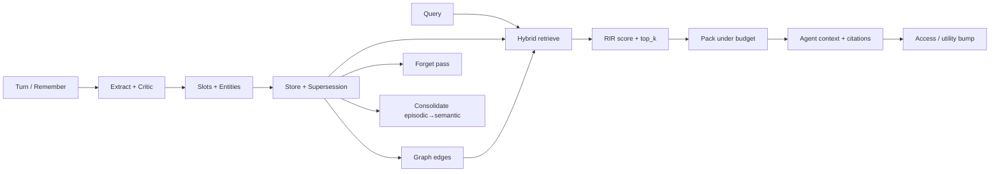

# Continuum Memory Architecture V2

**Status:** Design target for Loop 1–2 upgrades (2026-07-18)  
**Implements subset of:** [`AGENT_MEMORY_SURVEY.md`](./AGENT_MEMORY_SURVEY.md)  
**Plan:** [`IMPROVEMENT_PLAN.md`](./IMPROVEMENT_PLAN.md)

---

## 1. Design principles

1. **Retrieve-then-pack (must)** — Never score the full workspace as the sole pack input when N > `top_k`. Candidates first, then pack under budget.  
2. **Hybrid channels** — Sparse + dense + entity/slot; union then RIR re-rank.  
3. **Science-honest scoring** — Generative Agents–style importance/recency/relevance with equal weights; document approximations (heuristic importance vs LLM 1–10).  
4. **Typed + slotted facts** — Decisions/preferences carry structured `slots` for supersession.  
5. **Governed forgetting** — Expire, decay, supersede, audit; optional HITL for high-utility.  
6. **Multi-agent access** — Same substrate via MCP stdio and HTTP API; workspace isolation + API keys.  
7. **Claim only what ships** — Architecture describes targets; README/assessment list *implemented* features.

---

## 2. Pipeline



---

## 3. Retrieve-then-pack

### Retrieve

1. Load active memories for `workspace_id` (optional `as_of`).  
2. If `N ≤ top_k`, candidates = all active.  
3. Else:
   - **Sparse:** token/substring + entity overlap + slot key hits → top_k  
   - **Dense:** cosine(`embed(query)`, `embed(content+entities)`) → top_k (use embed cache when available)  
   - **Entity:** force-include memories sharing query entities  
   - **Graph 1-hop:** neighbors of sparse/dense hits via `related_to` / `mentions` / `supersedes`  
4. Union, dedupe, **RIR re-rank**, truncate to `2 * top_k`.

### Pack

Algorithms (selectable): `type_quota` (default), `greedy`, `knapsack_dp`, `mmr`.  
Score for ranking = `combined_rir` (+ small type prior).  
Token estimate: `len(text)//4` (unchanged; not tiktoken).

---

## 4. Importance / recency / relevance (Generative Agents)

Within a candidate set C:

| Signal | Formula (Continuum Loop 1) | Literature |
|--------|----------------------------|------------|
| Recency | `0.995 ** hours_since(last_accessed)` | Park et al. 2023 |
| Importance | Normalize `0.4*utility + 0.4*confidence + 0.2*type_prior` (optional field `importance`) | Approximation of LLM 1–10 |
| Relevance | `0.6 * dense_cos + 0.4 * sparse_norm` | Embedding + lexical |

Then min-max each to [0,1] over C;  
`score = α_r * recency + α_i * importance + α_rel * relevance` with α=1.

**Not claimed:** identical LLM importance prompts from the paper unless `CONTINUUM_LLM_IMPORTANCE=1` and a client is present (Loop 4: `score_importance_with_llm` / `maybe_assign_llm_importance`).

---

## 5. Hybrid sparse + dense + entity

| Channel | Implementation status |
|---------|----------------------|
| Sparse | In-process token/substring (BM25 index = P1) |
| Dense | Local hashed BoW or DashScope embedding |
| Entity | Explicit entity list overlap |
| Graph | Minimal edges + 1-hop (Loop 1); PPR = not implemented |

---

## 6. Memory graph (feasible subset)

```
MemoryEdge:
  id, workspace_id, src_id, dst_id, relation, created_at
  relation ∈ {mentions_entity, related_to, supersedes}
```

On write: for each entity shared with recent actives, add `related_to` (cap edges per write).  
Supersession already writes logical supersedes; mirror as edge.  
Retrieve: expand 1 hop from hybrid hits — **not** full HippoRAG PageRank.

---

## 7. Write critic + structured slots

- Heuristic extract rejects pure interrogatives.  
- Optional LLM extract + `critique_memories`.  
- `extract_slots` → `discount_pct`, VIP flags, etc.  
- Slot conflict → supersession (multi-id `supersedes` list).

---

## 8. Consolidation (reflection stub)

`POST /v1/memories/consolidate` / MCP `memory_consolidate`:

1. Select active `episodic` memories.  
2. Group by primary entity (or `unknown`).  
3. For groups with ≥2 items, write one `semantic` memory summarizing contents (heuristic join; LLM summarize if client available).  
4. Tag source episodics `policy_tags += ["consolidated"]` — keep for audit; forgetting pass may decay later.  

This is a **stub of** Generative Agents reflection / ACL “Storage→Reflection”, not full hierarchical reflection trees.

---

## 9. Eval protocol

| Baseline | Behavior |
|----------|----------|
| `naive_topk_keyword` | Top-k keyword hits concatenated under budget |
| `continuum_pack` | Full retrieve+RIR+pack |
| Ablations | `no_rir`, `sparse_only`, `dense_only` (when enabled) |

Metrics: **recall@budget**, **stale_leakage**, token use.  
Gate: Continuum aggregate recall ≥ naive and stale ≤ naive.  
Fixtures under `evals/fixtures/*.json`.

---

## 10. Multi-agent access

| Surface | Isolation | Auth |
|---------|-----------|------|
| HTTP `/v1/*` | `workspace_id` on every call | API keys + RPM |
| MCP stdio | Same service / DB | Env keys optional; trust local process |
| Org RBAC | Future | `org_id` stored, not enforced |

---

## 11. Explicit non-goals (this version)

- Claiming HippoRAG multi-hop accuracy  
- Claiming MemGPT sleep-time compute  
- Production Postgres multi-tenant SaaS  
- Paid Alibaba free-tier bypasses  

---

## 12. Mapping to packages

| Module | Role |
|--------|------|
| `schemas.py` | Memory, PackedContext, edges fields |
| `scoring.py` | RIR |
| `retrieve.py` | Hybrid + graph expand |
| `packer.py` | Budget algorithms |
| `consolidate.py` | Distill job |
| `graph.py` | Edges |
| `service.py` | Facade |
| `continuum_api` | HTTP |
| `continuum_mcp` | MCP tools |
| `continuum_eval` | Metrics |
