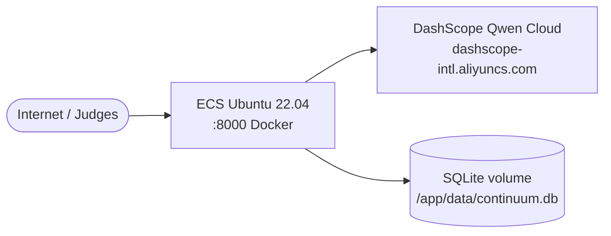

# Continuum — Alibaba Cloud Deployment Guide

> **WARNING — Free tier only.** Abort if not free-trial eligible. Do not create pay-as-you-go non-trial SKUs. Claim via [ECS Trial Center](https://ecs-buy.alibabacloud.com/trialCenter#/internationalPersonalTrial) (prefer Singapore `ap-southeast-1`) or FC free CU (150k CU/mo) first. Prefer the smallest trial instance type shown in the offer — never from the paid catalog.

Deploy Continuum (FastAPI + demo UI + SQLite) to **Alibaba Cloud International** for the Qwen Cloud Hackathon Track 1 PoD.

**Primary path:** ECS + Docker (fastest), free-trial instance only. **Optional:** push image to ACR for repeatable pulls.

## Topology



ASCII equivalent:

```
Internet ──► ECS:8000 (Continuum container)
                  │
                  ├──► DashScope (Qwen chat + embeddings)
                  └──► /app/data/continuum.db (persistent disk)
```

## Prerequisites

| Item | Notes |
|------|-------|
| Alibaba Cloud International account | [alibabacloud.com](https://www.alibabacloud.com) |
| Docker locally | Build and smoke-test before ECS |
| `DASHSCOPE_API_KEY` | From DashScope console; never commit to git |
| Public GitHub repo | For code-link PoD field |

## Environment variables

| Variable | Required | Default | Purpose |
|----------|----------|---------|---------|
| `DASHSCOPE_API_KEY` / `QWEN_API_KEY` | For live Qwen | — | DashScope compatible-mode API |
| `CONTINUUM_DB_PATH` | No | `data/continuum.db` | SQLite file (use `/app/data/continuum.db` in Docker) |
| `CONTINUUM_AUTH_DISABLED` | No | off when keys set | `1` = open demo API |
| `CONTINUUM_API_KEYS` | No | empty | Comma-separated keys when auth enabled |
| `CONTINUUM_CORS_ORIGINS` | No | — | Extra comma-separated CORS origins for public URL |
| `CONTINUUM_RATE_LIMIT_RPM` | No | `60` | Per-key/IP rate limit |
| `QWEN_MODEL` | No | `qwen-flash` | Chat model |
| `QWEN_EMBED_MODEL` | No | `text-embedding-v3` | Embedding model |

See [.env.example](../.env.example).

## Local container smoke

1. Copy env file: `copy .env.example .env` (add `DASHSCOPE_API_KEY` for live Qwen).
2. Build and run:

   ```powershell
   .\infra\scripts\build.ps1
   .\infra\scripts\run-local.ps1
   ```

   ```bash
   ./infra/scripts/build.sh
   ./infra/scripts/run-local.sh
   ```

3. Health check:

   ```powershell
   .\infra\scripts\smoke-health.ps1
   ```

   ```bash
   ./infra/scripts/smoke-health.sh
   ```

4. Open http://127.0.0.1:8000/

Or use root `docker-compose.yml` directly: `docker compose up --build`.

## Deploy to ECS (recommended)

Step-by-step runbook: **[ecs/DEPLOY.md](ecs/DEPLOY.md)**

Includes:

- Security group rules ([ecs/security-group.md](ecs/security-group.md))
- cloud-init script ([ecs/user-data.sh](ecs/user-data.sh))
- `/etc/continuum.env` template on the instance ([continuum.env.example](continuum.env.example))
- Public URL verification

## Optional: ACR image push

Build once locally, push to Container Registry, pull on ECS:

- Guide: [acr/push.md](acr/push.md)
- Scripts: [acr/push.ps1](acr/push.ps1), [acr/push.sh](acr/push.sh)

Placeholders: `REGISTRY`, `NAMESPACE`, `IMAGE=continuum`, `TAG=latest`, region e.g. `ap-southeast-1`.

## After deploy — hackathon proof

1. Confirm public health: `curl http://YOUR_PUBLIC_IP:8000/v1/health`
2. Screenshot Alibaba **Workbench** (ECS instance Running) → save as `docs/screenshots/alibaba_workbench.png`
3. Fill placeholders in [docs/PROOF_OF_ALIBABA_DEPLOYMENT.md](../docs/PROOF_OF_ALIBABA_DEPLOYMENT.md)
4. Devpost: code file link to `packages/agent/continuum_agent/client.py` + Workbench screenshot

See also [docs/HACKATHON_SUBMIT.md](../docs/HACKATHON_SUBMIT.md).

## Phase B alternatives

| Path | Doc | Notes |
|------|-----|-------|
| Function Compute | [fc/README.md](fc/README.md) | Free CU / free trial only; custom container; SQLite volume is harder |
| ACK / SLB / HTTPS | Optional future | **Not** for free-tier MVP — paid path; not required for PoD |

## Scripts reference

| Script | Purpose |
|--------|---------|
| [scripts/build.ps1](scripts/build.ps1) / [build.sh](scripts/build.sh) | `docker build -t continuum:local .` |
| [scripts/run-local.ps1](scripts/run-local.ps1) / [run-local.sh](scripts/run-local.sh) | `docker compose up --build` |
| [scripts/smoke-health.ps1](scripts/smoke-health.ps1) / [smoke-health.sh](scripts/smoke-health.sh) | GET `/v1/health` |

## No live provisioning in repo

This directory contains **scaffolding only** — Dockerfiles, scripts, and runbooks. Creating ECS instances is a manual operator step. Use free-trial packages only; abort if the console routes to a paid catalog.
