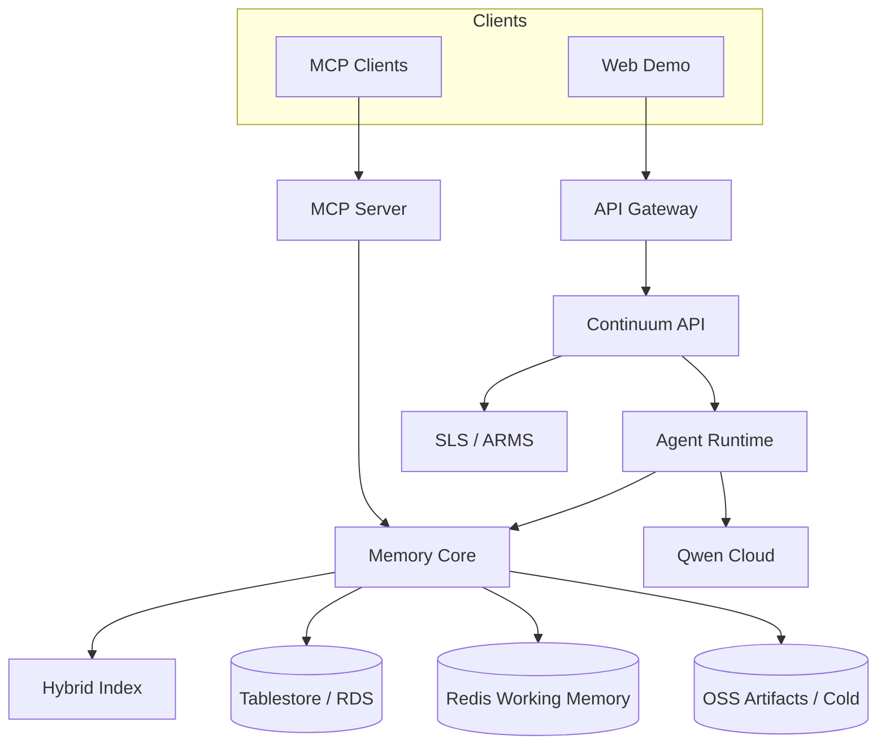

# PRD: Continuum

**Product name:** Continuum  
**One-liner:** The production Memory Operating System for agents — accumulates experience across sessions, recalls the critical subset under strict context budgets, forgets on purpose, and measurably improves decisions over time.  
**Hackathon:** Global AI Hackathon Series with Qwen Cloud  
**Primary track:** Track 1 — MemoryAgent  
**Submission deadline (hackathon only):** July 20, 2026 @ 2:00pm PDT  
**Owner:** kenhuangus@gmail.com  
**Status:** Full-ambition product PRD — **no schedule or scope cuts for time**. Build the best possible MemoryAgent.  
**Quality bar:** Exceed every official judging criterion; ship research-grade evaluation, production architecture, and a demo that makes track requirements obvious in under three minutes.  
**License (repo):** Apache-2.0  

---

## 1. Executive summary

Continuum is a **persistent, self-improving MemoryAgent platform** for knowledge-work organizations (customer success, sales ops, technical consulting, IT service management). It rejects the false choices that dominate today’s agent stacks:

| Common approach | Failure mode | Continuum |
|---|---|---|
| Dump full chat history | Burns context; still misses critical facts | Budget-aware **Context Packer** |
| Naive vector RAG | Retrieves similar text, not decisions | Typed **decision-grade** memories + provenance |
| “Remember everything” | Stale contradictions poison answers | **Forgetting engine** with supersession & audit |
| Stateless tools | No cross-session learning | Hierarchical memory + writeback learning loop |

Continuum’s substrate:

1. **Accumulates** episodic events, semantic facts, preferences, procedural playbooks, and formal decisions across multi-turn *and* cross-session interactions  
2. **Retrieves** candidates with hybrid search (dense + sparse + entity + structured filters)  
3. **Packs** only the critical subset that fits a limited context window (optimal / near-optimal knapsack under token budget)  
4. **Forgets** outdated, contradicted, low-utility, or policy-violating memories with full provenance  
5. **Improves** decision quality over time — proven with an open benchmark suite and live telemetry  

**Runtime:** Qwen Cloud (reasoning, structured extraction, tool calling, embeddings, optional multimodal ingest)  
**Deployment:** Alibaba Cloud (API Gateway, Function Compute and/or ACK/ECS, Tablestore/RDS, Redis, OSS, observability)  
**Extensibility:** First-class **MCP server** + custom Qwen Cloud skills — matching judge language around sophisticated API / MCP use  

**Why Continuum can win Track 1:** the track brief asks for efficient storage/retrieval, timely forgetting, and critical recall under limited context. Continuum makes those three requirements the *product core*, then surrounds them with production engineering, measurable science, and a cinematic but honest demo.

---

## 2. Vision

**North star:** Every agent that talks to Continuum should become more accurate the longer it serves a workspace — *without* unbounded context growth.

**Product thesis:** Memory is not a database feature bolted onto a chatbot. Memory is a **governed cognitive substrate** with write policies, read budgets, conflict resolution, decay, and explanation.

**Long-term (post-hackathon, still in this PRD as first-class scope):** Continuum becomes the open Memory OS that other agents plug into via MCP — the “Postgres of agent memory,” with Continuum’s own reference agent proving the quality bar.

---

## 3. Problem statement

### Pain

Institutional knowledge dies between sessions:

- Preferences and prior decisions are re-elicited endlessly  
- Contradictory facts accumulate (old pricing, stale SLAs, outdated owners)  
- Long transcripts waste tokens and still drop the one binding commitment  
- RAG returns *nearby prose*, not *who decided what, when, why, and until when*  
- There is no audit trail for why an agent “knew” or “forgot” something  

### Opportunity

Track 1 explicitly rewards agents that **accumulate experience** and make **increasingly accurate decisions**. A winning submission will not merely store text — it will demonstrate:

- Efficient memory storage and retrieval  
- Timely forgetting of outdated information  
- Recalling critical memories within limited context windows  
- Engineering sophistication (architecture, MCP/skills, evaluation)  
- Real-world impact and open-source leverage  

Continuum is designed to dominate that checklist end-to-end.

---

## 4. Goals & non-goals

### Goals (quality bar — all in scope)

| Goal | Judging map |
|---|---|
| Cross-session continuity that *changes* answers between Session A → Session B | Track fit + Innovation |
| Hierarchical typed memory with provenance and confidence | Innovation + Engineering |
| Hybrid retrieval + multi-strategy **Context Packer** under configurable budgets | Engineering + Innovation |
| Timely forgetting: TTL, decay, supersession, policy, HITL, cold archive | Track fit + Innovation |
| Contradiction detection and resolution with explainability | Innovation |
| Learning loop: outcomes write back as procedural / decision memories | Innovation + Impact |
| MCP memory server + Qwen custom skills + external system adapters | Innovation (MCP/skills) |
| Production multi-workspace architecture on Alibaba Cloud | Engineering + Eligibility |
| Research-grade eval suite with public leaderboard-style reports | Engineering + Impact |
| Observability, SLOs, failure modes, graceful degradation | Engineering |
| World-class docs, architecture visuals, ≤3 min demo that proves the thesis | Presentation |
| Open-source Memory OS others can embed | Impact |

### Non-goals (out of product identity — not “because of time”)

These are excluded to stay a **MemoryAgent** winner, not a unfocused multi-track mashup:

- Replacing a full CRM / ITSM suite as the system of record (Continuum *augments* them)  
- Competing as an Edge robot / IoT device product (Track 5)  
- Competing as a short-drama video studio (Track 2)  
- Competing primarily as a multi-agent society benchmark (Track 3) — Continuum may *use* internal specialist roles for extraction/critique, but the submitted track identity remains MemoryAgent  
- Fine-tuning a custom foundation model as the main contribution (optional later research; not required to win)  

---

## 5. Positioning for judges (scorecard attack plan)

Official Stage-2 weights — Continuum is engineered so each weight has **multiple undeniable artifacts** in code, docs, and video.

### 5.1 Innovation & AI Creativity — 30%

**Artifacts judges should see:**
- Hierarchical memory: Working → Episodic → Semantic → Preference → Procedural → Decision  
- **Contradiction graph** + supersession links  
- **Forgetting policies** as first-class programmable rules  
- **Context Packer** suite: greedy, dynamic programming knapsack, diversity-aware MMR packing; selectable per workspace  
- **Memory utility learning** from outcomes (which memories correlated with correct decisions)  
- **MCP Memory Server** + Qwen tool-calling skills (not chat-only)  
- Optional multimodal memory ingest (docs, screenshots, voice notes → typed memories via Qwen VL / ASR)  

### 5.2 Technical Depth & Engineering — 30%

**Artifacts judges should see:**
- Modular pipeline: `ingest → extract → normalize → conflict → embed → index → retrieve → score → pack → reason → act → writeback → forget`  
- Strong schemas (Pydantic / JSON Schema), idempotent writes, retries, dead-letter handling  
- Storage layering: hot (Redis working), warm (Tablestore/RDS), cold (OSS archive)  
- Hybrid index: dense vectors + BM25/sparse + entity inverted index  
- Observability: trace IDs, memory hit/miss, packer fill ratio, stale leakage, token split (memory vs reason vs tools)  
- CI: unit + integration + eval regression gates  
- Hardened Alibaba deployment (IaC, secrets, health checks, autoscaling)  

### 5.3 Problem Value & Impact — 25%

**Artifacts judges should see:**
- Concrete personas and money-adjacent scenarios (pricing exceptions, SLA commitments, VIP prefs)  
- Before/after metrics on real fixture workspaces  
- Open-source `continuum-memory` library + MCP server others can adopt  
- Clear productization path: Memory OS for enterprise agents  

### 5.4 Presentation & Documentation — 15%

**Artifacts judges should see:**
- Architecture diagrams (system, memory hierarchy, packer, deploy)  
- Interactive demo UI that visualizes packed context and forget audits  
- ≤3 minute video with zero ambiguity about track fit  
- README + EVAL.md + PROOF_OF_ALIBABA_DEPLOYMENT.md + ADRs  

### Stage 1 pass/fail

Continuum’s entire product identity *is* MemoryAgent + Qwen Cloud APIs. Stage 1 is designed to be unambiguous.

---

## 6. Personas & jobs-to-be-done

### 6.1 Maya — Customer Success Lead (primary)

**JTBD:** “When I or my team make commitments to an account, help every future agent session honor them — and stop using expired ones.”

### 6.2 Theo — Solutions Architect / Ops Engineer

**JTBD:** “Capture runbooks and incident learnings so the next on-call doesn’t rediscover them from scratch.”

### 6.3 Aisha — Platform Engineer (buyer of Memory OS)

**JTBD:** “Plug Continuum into our existing agents via MCP and govern memory with policies, budgets, and audits.”

### 6.4 Judge / Evaluator (meta-persona)

**JTBD:** “In three minutes, understand that this is not a chatbot with a vector DB — it is a governed memory system with proof.”

---

## 7. Core use cases

### UC1 — Cross-session institutional recall (canonical demo)

Session A records VIP status, discount decision, channel preference, contacts.  
Session B (new session, same workspace) answers commercial questions correctly with citations under a tight memory budget.

### UC2 — Timely forgetting & supersession

A correction (“discount is 10%, not 12%”) supersedes the prior decision. Subsequent answers never leak the stale 12%. Audit shows why.

### UC3 — Budget stress test

Force a tiny memory budget. Continuum still surfaces the *binding decision* over low-value chit-chat memories. UI shows packing choices.

### UC4 — Procedural learning

After resolving an escalation using a playbook, Continuum writes/updates procedural memory; next similar incident retrieves the playbook first.

### UC5 — MCP-native external agent

Claude/Cursor/other MCP client calls `memory_search` / `memory_remember` against Continuum — proving the Memory OS surface beyond the reference UI.

### UC6 — Multimodal ingest

Upload a contract PDF or screenshot of a Slack commitment → Qwen extracts typed decision memories with provenance pointing to the artifact in OSS.

### UC7 — Policy-governed memory

Workspace policy: “Never retain personal phone numbers longer than 30 days.” Continuum auto-forgets matching preference memories and logs compliance events.

### UC8 — Multi-workspace enterprise

Switch between Acme / Globex workspaces; hard isolation; shared procedural playbooks optionally promoted to org library with review.

---

## 8. Product principles

1. **Decision-grade > similar-text** — prefer typed commitments over fuzzy chunks  
2. **Budget is a feature** — constraints force better memory science  
3. **Forgetting is intelligence** — not a bug; make it visible and auditable  
4. **Explain every include/exclude** — packer and forgetter must answer “why”  
5. **Writeback learning** — successful outcomes reinforce utility; failures trigger review  
6. **Open substrate** — MCP and library APIs first-class, UI is a reference client  
7. **Production honesty** — retries, isolation, observability, no demo-ware architecture  

---

## 9. Functional requirements

### 9.1 Agent experience

| ID | Requirement | Priority |
|---|---|---|
| F1 | Multi-turn chat via Qwen Cloud tool-calling | Must |
| F2 | Cross-session continuity by `org_id` + `workspace_id` (+ optional `user_id`) | Must |
| F3 | Automatic memory extraction after each turn (structured schema) | Must |
| F4 | Explicit commands: remember / forget / what do you know / explain memory | Must |
| F5 | Memory-backed answers include citations (memory IDs + timestamps + type) | Must |
| F6 | HITL confirmation for destructive forget of high-confidence / policy-protected memories | Must |
| F7 | Streaming responses with side-panel live packer view | Must |
| F8 | Session branching / “what if” sandboxes that don’t pollute canonical memory without merge | Should |
| F9 | Multi-user workspace with role-based memory visibility (private notes vs shared decisions) | Should |
| F10 | Multimodal ingest (PDF, image, audio) → typed memories | Should |
| F11 | Org-level playbook library with promotion workflow | Should |

### 9.2 Memory substrate

| ID | Requirement | Priority |
|---|---|---|
| M1 | Types: `episodic`, `semantic`, `preference`, `procedural`, `decision`, `artifact_ref` | Must |
| M2 | Full metadata: confidence, utility, entities, provenance, status, expiry, supersession links | Must |
| M3 | Hybrid retrieval: dense + sparse + entity filters + structured field queries | Must |
| M4 | Pluggable **Context Packers** under `memory_token_budget` | Must |
| M5 | Forgetting engine: TTL, decay, supersession, utility cull, policy rules, explicit HITL | Must |
| M6 | Contradiction detection across semantic/decision memories | Must |
| M7 | `memory.explain` for include/exclude/forget decisions | Must |
| M8 | Memory graph visualization (entities ↔ memories ↔ supersession) | Must |
| M9 | Working-memory consolidation scheduler (episodic → semantic distillation) | Must |
| M10 | Utility learning from feedback / outcome labels | Should |
| M11 | Deduplication / merge of near-duplicate semantic memories | Should |
| M12 | Temporal queries (“what did we believe about Acme last quarter?”) via as-of reads | Should |
| M13 | Cryptographic or hash-chained audit log for compliance-sensitive workspaces | Could |

### 9.3 Tools, skills, MCP

| ID | Requirement | Priority |
|---|---|---|
| T1 | MCP server (stdio + HTTP/SSE) for memory tools | Must |
| T2 | Tools: search, remember, forget, list, explain, stats, pack_preview, as_of | Must |
| T3 | Qwen Cloud custom skills wrapping the same operations | Must |
| T4 | Adapters: email draft, ticket stub, calendar note, webhook egress (real interfaces; sandbox implementations OK for demo data) | Must |
| T5 | Connector framework for CRM/ITSM (Salesforce/Jira-shaped interfaces) | Should |
| T6 | Bidirectional sync policies (Continuum as cache vs system-of-record pointer) | Should |

### 9.4 Evaluation & science

| ID | Requirement | Priority |
|---|---|---|
| E1 | Public fixture suite: ≥50 cross-session scenarios across domains | Must |
| E2 | Baselines: no-memory, full-history, naive top-k RAG, summary-memory, Continuum variants | Must |
| E3 | Metrics: critical-fact recall@budget, stale leakage, token use, latency, contradiction handling F1, preference retention, decision accuracy over session index | Must |
| E4 | LLM-as-judge + exact/keyed scoring; human review subset | Must |
| E5 | Reproducible CLI + CI regression budgets | Must |
| E6 | Ablation studies: packer type, forgetting on/off, hybrid vs dense-only | Must |
| E7 | Published EVAL report in repo with charts | Must |
| E8 | Adversarial suite: prompt injection via stored memories, poisoned prefs | Should |

### 9.5 Platform, deploy, submission eligibility

| ID | Requirement | Priority |
|---|---|---|
| D1 | Backend on Alibaba Cloud with real service usage | Must |
| D2 | Proof doc linking to concrete code/IaC using Alibaba APIs/services | Must |
| D3 | Architecture diagrams + ADRs | Must |
| D4 | Public GitHub + detectable open-source LICENSE | Must |
| D5 | ≤3 min public demo video | Must |
| D6 | English docs; working demo access for judges | Must |
| D7 | Secrets via KMS/secret store; no keys in git | Must |
| D8 | Optional blog/social journey post for Blog Prize | Should |

---

## 10. Memory architecture (core IP)

### 10.1 Hierarchy

```
┌──────────────────────────────────────────────────────────────┐
│ Working Memory (session-scoped, Redis)                       │
│  active goals, last turns, pending tools, scratchpad         │
└────────────────────────────┬─────────────────────────────────┘
                             │ consolidate / distill
┌────────────────────────────▼─────────────────────────────────┐
│ Episodic Memory                                              │
│  timestamped events with actors & outcomes                   │
└────────────────────────────┬─────────────────────────────────┘
                             │ cluster / abstract
┌────────────────────────────▼─────────────────────────────────┐
│ Semantic Memory          │ Preference Memory                 │
│  durable world facts     │  durable taste / channel / VIP    │
├──────────────────────────┼───────────────────────────────────┤
│ Procedural Memory        │ Decision Memory                   │
│  playbooks / how-to      │  commitments w/ effective dating  │
├──────────────────────────┴───────────────────────────────────┤
│ Artifact Refs (OSS): PDFs, images, audio → grounded evidence │
└──────────────────────────────────────────────────────────────┘
```

### 10.2 Write pipeline

1. **Ingest** turn / artifact / tool result  
2. **Extract** candidate memories (Qwen structured output; multi-pass extractor + critic)  
3. **Normalize** entities and canonical keys  
4. **Deduplicate / merge** near-duplicates  
5. **Conflict check** against active semantic & decision memories  
6. **Policy check** (retention, PII, workspace rules)  
7. **Upsert** + supersession links  
8. **Embed + index** (dense/sparse/entity)  
9. **Emit audit**  

### 10.3 Read pipeline

1. Interpret query intent (factual / preference / procedural / decision)  
2. Hybrid retrieve candidates  
3. Score:  
   `score = α·sim + β·recency + γ·utility + δ·confidence + ζ·type_prior(intent) − ε·staleness − η·policy_penalty`  
4. **Pack** under token budget (selected algorithm)  
5. Inject cited memory block into Qwen context  
6. Update access stats; optional reinforcement  

### 10.4 Packer algorithms (all implemented; workspace-selectable)

| Packer | Idea |
|---|---|
| `greedy` | Highest score first until budget exhausted |
| `knapsack_dp` | Maximize total score under token weights |
| `mmr` | Balance relevance with diversity to avoid near-duplicate packing |
| `type_quota` | Reserve slots for decision/preference before episodic filler |
| `as_of` | Pack only memories valid at a historical timestamp |

### 10.5 Forgetting policies

| Policy | Behavior |
|---|---|
| TTL | Hard expiry |
| Confidence decay | Unused memories lose confidence; drop below threshold |
| Supersession | Contradictions retire old memories with links |
| Utility cull | Storage pressure removes lowest utility first |
| Policy retention | Compliance-driven forget (PII, region rules) |
| Explicit HITL | User/admin confirmed forget |
| Cold archive | Move forgotten/superseded bodies to OSS; keep tombstone metadata |

### 10.6 Internal specialist roles (implementation detail — still Track 1)

Continuum may run lightweight internal roles for quality (Extractor, Critic, Contradiction Arbiter, Packer Explainer). These are **memory pipeline stages**, not a Track-3 society product. The submission narrative stays MemoryAgent.

---

## 11. System architecture

### 11.1 Logical components

| Component | Responsibility |
|---|---|
| `apps/web` | Judge-legible demo: chat, memory inspector, packer view, graph, eval snapshots |
| `apps/api` | Auth, workspaces, agent orchestration, admin policy |
| `packages/agent` | Qwen tool-calling runtime |
| `packages/memory-core` | Extract/conflict/retrieve/pack/forget/utility |
| `packages/mcp-server` | MCP surface |
| `packages/connectors` | External adapters |
| `packages/eval` | Benchmarks, ablations, reports |
| `infra/` | Alibaba IaC (Terraform/ROS), CI/CD |

### 11.2 Deployment topology (Alibaba Cloud)

```
Clients (Web, MCP, API)
        │
        ▼
Alibaba API Gateway (+ WAF as appropriate)
        │
        ▼
ACK / ECS / Function Compute  (Continuum API + workers)
        │
        ├──────────────► Qwen Cloud (chat, tools, embeddings, VL/ASR)
        │
        ├─ Redis ──────── working memory / rate limits
        ├─ Tablestore or RDS ─ warm memories + audits
        ├─ Vector index (open-source in-proc or Alibaba vector offering)
        ├─ OSS ────────── artifacts + cold archive + reports
        └─ SLS / ARMS ── logs, traces, metrics
```

### 11.3 Reference Mermaid



---

## 12. Data model (canonical)

```json
{
  "id": "mem_01H...",
  "org_id": "org_demo",
  "workspace_id": "acme",
  "type": "decision",
  "content": "Approved 12% discount for Acme through 2026-12-31",
  "entities": ["account:acme", "discount:12"],
  "confidence": 0.92,
  "utility": 0.80,
  "status": "active",
  "effective_from": "2026-07-01T00:00:00Z",
  "effective_to": "2026-12-31T23:59:59Z",
  "created_at": "2026-07-18T12:00:00Z",
  "last_accessed_at": "2026-07-18T12:00:00Z",
  "source": {
    "kind": "user_statement",
    "turn_id": "turn_42",
    "artifact_id": null,
    "actor_id": "maya"
  },
  "superseded_by": null,
  "supersedes": ["mem_old_01"],
  "policy_tags": ["commercial", "customer_commit"],
  "embedding_ref": "emb_...",
  "version": 3
}
```

---

## 13. API surface (product-grade)

### HTTP

- `POST /v1/chat` — agent turn with budget + workspace context  
- `POST /v1/chat/stream` — SSE/WebSocket streaming  
- `GET/POST /v1/memories` — CRUD/search  
- `POST /v1/memories/{id}/forget`  
- `GET /v1/memories/pack_preview` — deterministic packer inspection  
- `GET /v1/memories/graph`  
- `GET /v1/memories/as_of`  
- `POST /v1/artifacts` — multimodal ingest  
- `GET /v1/evals/latest`  
- `GET /v1/health` `/v1/ready`  
- Admin: workspaces, policies, API keys, connector configs  

### MCP tools

`memory_search`, `memory_remember`, `memory_forget`, `memory_list`, `memory_explain`, `memory_stats`, `memory_pack_preview`, `memory_as_of`, `memory_promote_playbook`

---

## 14. UX requirements

The UI exists to make the science visible:

1. Chat with streaming  
2. **Memory Inspector** — active / superseded / forgotten filters  
3. **Packer Panel** — exact memories injected + token meter + algorithm used  
4. **Contradiction / Audit Timeline**  
5. **Memory Graph**  
6. Budget & packer controls  
7. Workspace switcher  
8. Eval snapshot widget (latest regression numbers)  
9. MCP connection instructions panel  

Design principle: one composition for the demo hero flow; deep panels for judges who click around. No decorative dashboard clutter in the first viewport of the marketing/demo landing — product console can be denser.

---

## 15. Success metrics

### Quality metrics (optimize without ceiling)

| Metric | Ambition |
|---|---|
| Critical-fact recall@1500 tok | Best-in-suite; beat all baselines by clear margin |
| Stale-fact leakage after supersession | Near-zero on fixture + adversarial sets |
| Token reduction vs full-history | Large savings with minimal accuracy loss |
| Contradiction handling F1 | High precision/recall on conflict suite |
| Preference retention across ≥10 sessions | Perfect on canonical paths; robust on noisy paths |
| Pack explain faithfulness | Spot-check + judge rubric |
| p95 latency | Production-acceptable for interactive chat |
| Eval regression | CI fails on statistically meaningful drops |

### Hackathon outcome metrics

- Stage 1 pass: certain  
- Stage 2: each weight backed by multiple artifacts  
- Submission completeness: 100% of Devpost requirements  
- Optional Blog Prize entry published  

---

## 16. Delivery plan (quality-phased — not time-boxed)

Phases define **maturity**, not calendars. Do not skip earlier phase quality to “finish fast”; advance when the bar is met.

### Phase A — Memory truth

Typed store, extract/write, hybrid retrieve, greedy pack, session continuity, local+cloud Qwen path, inspector UI.

**Exit bar:** Session B recall works; citations visible.

### Phase B — Track dominance

Contradiction/supersession, full forgetting engine, multiple packers, explain APIs, memory graph, audit timeline.

**Exit bar:** Budget + forget demo path is undeniable on video.

### Phase C — Production substrate

Alibaba deploy, warm/cold storage, Redis working memory, secrets, observability, IaC, proof docs.

**Exit bar:** Judges can hit a deployed endpoint; proof file references real code.

### Phase D — Science & MCP

Large fixture suite, baselines, ablations, CI evals, MCP server, connectors, multimodal ingest.

**Exit bar:** EVAL.md shows Continuum leading; MCP tools demonstrated.

### Phase E — Polish & narrative

Cinematic ≤3 min video, architecture visuals, ADRs, Devpost copy, blog post, open-source packaging (`pip install` / clear module boundaries).

**Exit bar:** Submission package feels inevitable for a Track 1 win.

---

## 17. Demo video script (≤ 3:00) — final narrative

| Time | Visual | Narration |
|---|---|---|
| 0:00–0:20 | Title + one diagram | Continuum: MemoryAgent that accumulates, budget-recalls, and forgets on purpose |
| 0:20–0:55 | Session A | Capture VIP + discount decision + preference; show typed writes |
| 0:55–1:25 | Packer panel | New session; tiny budget still keeps the binding decision; citations |
| 1:25–1:55 | Contradiction | Correction supersedes old decision; stale leakage blocked; audit shown |
| 1:55–2:25 | Eval charts | Continuum vs baselines on recall, leakage, tokens |
| 2:25–2:45 | MCP + multimodal | External MCP search; artifact→memory |
| 2:45–3:00 | Alibaba proof + open source | Deploy proof, Apache-2.0, Memory OS CTA |

---

## 18. Devpost submission copy (draft)

**Title:** Continuum — Memory OS for agents that learn what to remember and what to forget  

**Tagline:** Hierarchical, budget-aware, auditable memory on Qwen Cloud — deployed on Alibaba Cloud, exposed via MCP, proven with open evaluations.  

**Track:** MemoryAgent  

**Description:**  
Continuum is a production MemoryAgent platform for institutional knowledge. It converts conversations and artifacts into typed memories (episodic, semantic, preference, procedural, decision), retrieves with hybrid search, packs only what fits a strict context budget, and forgets stale or contradicted facts with full provenance. Internal extraction/critique stages improve write quality; an MCP server lets any agent use Continuum as a Memory OS. Deployed on Alibaba Cloud and evaluated against no-memory, full-history, and naive RAG baselines on critical-fact recall, stale leakage, and token efficiency.

**Built with:** Qwen Cloud, Alibaba Cloud, MCP, hybrid retrieval, Python, TypeScript, IaC  

---

## 19. Risks & mitigations (quality risks — not schedule)

| Risk | Mitigation |
|---|---|
| Memory extraction hallucinations | Multi-pass extractor+critic; schema validation; HITL for high-impact decisions |
| Packer instability | Deterministic seeds in eval; explain traces; ablation suite |
| Vector-only myopia | Hybrid retrieval + type priors + entity filters |
| Privacy / PII | Policy tags, retention rules, redaction tools, cold-store controls |
| Cloud cost / quota | Model routing (flash vs plus), caching, embedding dedupe, free-tier monitoring |
| Scope identity drift | Keep Track 1 narrative primary; internal multi-role ≠ Track 3 submission |
| Demo vs production gap | Same code paths; feature flags, not fork of demo-ware |

---

## 20. Security, privacy, compliance

- Synthetic demo data by default; clear warnings for real PII  
- Secrets in Alibaba secret management / env — never committed  
- Workspace isolation tested  
- Soft-delete + audit for forget; optional hard purge  
- Adversarial memory injection tests  
- Least-privilege RAM roles for Alibaba services  

---

## 21. Open source & ecosystem

- Apache-2.0 monorepo  
- Publishable `continuum-memory` core + `continuum-mcp`  
- Contributor docs, architecture ADRs, good-first-issues  
- Eval suite as a reusable community benchmark for MemoryAgents  
- Extension points: packers, forget policies, connectors  

---

## 22. Acceptance criteria (definition of “best”)

Continuum meets the win bar when:

1. Cross-session recall is reliable across large fixture suites, not one happy path  
2. Multiple packers work; explanations are faithful  
3. Forgetting/supersession prevents stale leakage under adversarial tests  
4. Eval report shows clear leadership vs baselines with ablations  
5. MCP and HTTP surfaces are complete and documented  
6. Alibaba deployment is real, observed, and proven in-repo  
7. Architecture + ADRs make engineering depth obvious  
8. ≤3 min video makes Track 1 requirements obvious without narration gymnastics  
9. Repo is public, licensed, reproducible  
10. Devpost fields are complete; optional blog submitted  

---

## 23. Decision log

| Decision | Choice | Rationale |
|---|---|---|
| Primary track | MemoryAgent | Closest 1:1 to brief; strongest innovation story |
| Ambition | Unbounded quality; phased maturity | User directive: time is not a constraint |
| Differentiator | Governed memory science + MCP + eval | Hits Innovation and Engineering simultaneously |
| Cloud | Qwen Cloud intl + Alibaba production stack | Eligibility + credibility |
| Internal multi-role extract/critique | Allowed as pipeline | Do not rebrand as Track 3 |
| UI role | Explainability instrument | Judges must *see* packing and forgetting |

---

## 24. Immediate next actions (start of Phase A)

1. Initialize public monorepo structure + LICENSE + ADR template  
2. Implement `memory-core` schemas + SQLite/Postgres store abstraction  
3. Qwen intl client with tool-calling agent loop  
4. Greedy packer + inspector UI vertical slice  
5. Stand up Alibaba project skeleton early so deploy proof is never bolted on  

---

## Appendix A — Canonical fixture sketch

**Session A:** VIP + 12% discount until Dec 31 + email preference + contact Jordan  
**Session B:** commercial terms question → cited correct recall under low budget  
**Correction:** discount → 10%; supersession; verify no 12% leakage  
**Noise flood:** 50 low-value episodic memories; packer still keeps decision  

## Appendix B — Judge one-pager

> **Continuum** is a Track-1 MemoryAgent that treats memory as a governed substrate: typed writes, hybrid retrieval, multi-strategy token-budget packing, and auditable forgetting. It uses Qwen Cloud for extraction, reasoning, and tools; exposes memory via MCP; deploys on Alibaba Cloud; and proves quality with an open evaluation suite. The demo shows the three track pillars — store/retrieve, forget, recall under limit — without asking judges to imagine them.

---

*End of PRD — full-ambition edition*
